# Evidencias

> Fecha de ejecución: 13/02/2026
> Clúster: 3 DataNodes (`docker compose up -d --scale dnnm=3`)

---

## 1) Clúster levantado

### Contenedores Docker
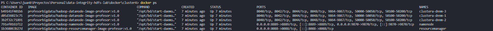

### NameNode UI - DataNodes vivos
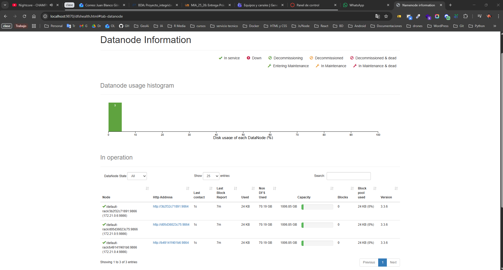

---

## 2) Pipeline de datos

### Bootstrap - Estructura HDFS (00_bootstrap.sh)
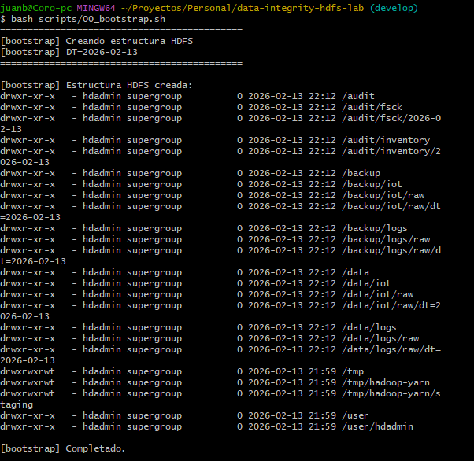

### Generación de datos (10_generate_data.sh)
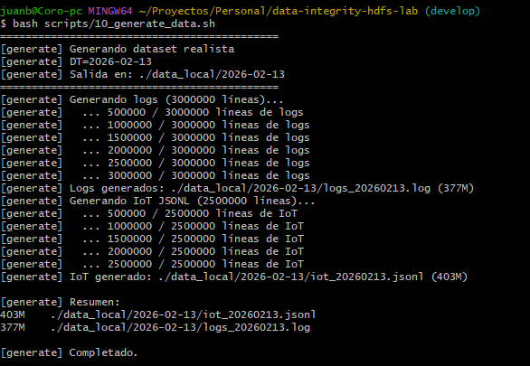

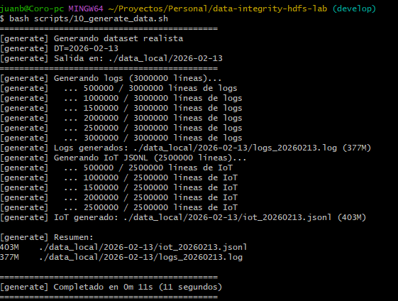

### Ingesta en HDFS (20_ingest_hdfs.sh)
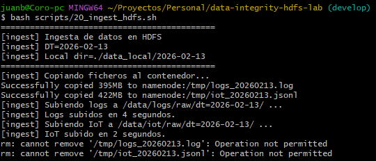

---

## 3) Verificación de datos en HDFS

### Browse Directory - IoT
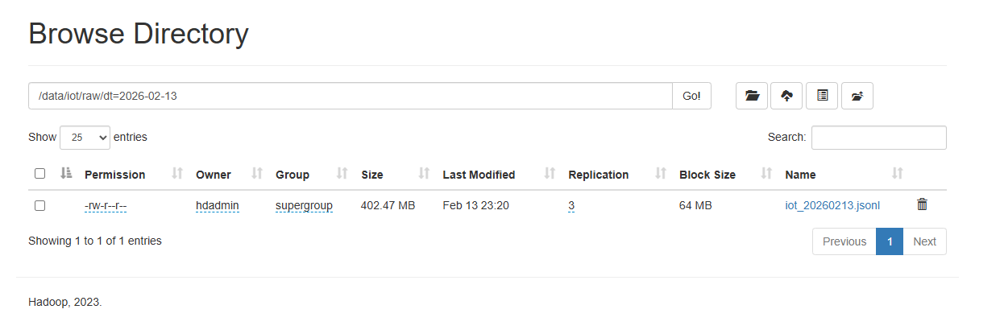

### Browse Directory - Logs
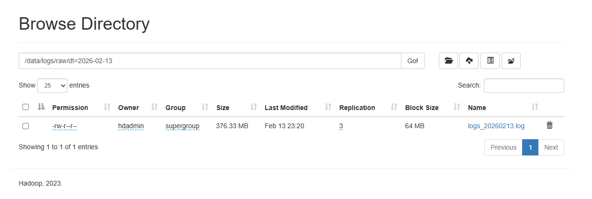

---

## 4) Auditoría fsck (30_fsck_audit.sh)

### Salida del script fsck
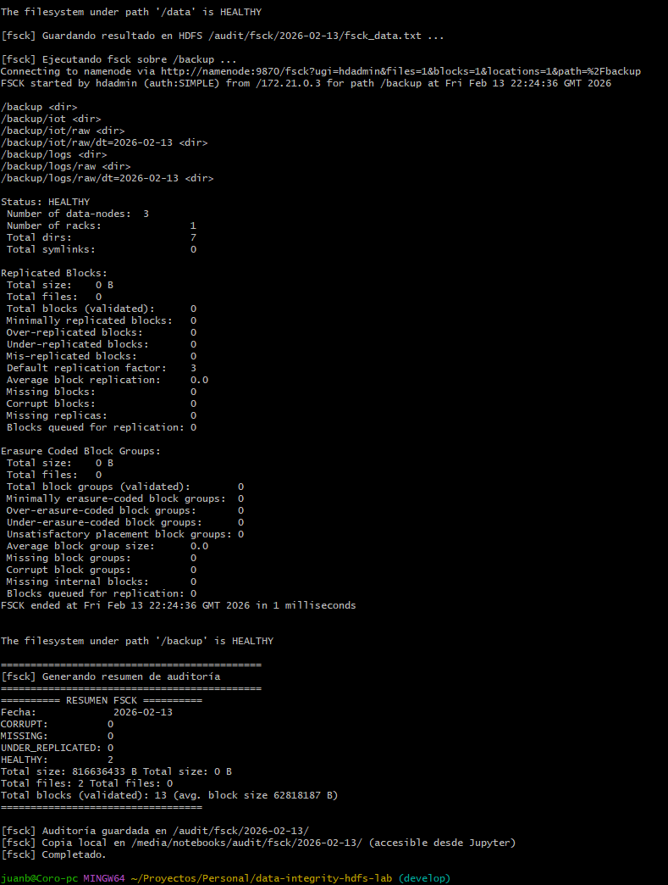

### Resumen de auditoría
| Métrica | Valor |
|---------|-------|
| Total size | 816,636,433 bytes (~779 MB) |
| Total files | 2 |
| Total blocks | 13 |
| CORRUPT | 0 |
| MISSING | 0 |
| UNDER_REPLICATED | 0 |
| HEALTHY | 2 |
| Status | **HEALTHY** |

---

## 5) Backup + validación

### Copia de backup (40_backup_copy.sh)
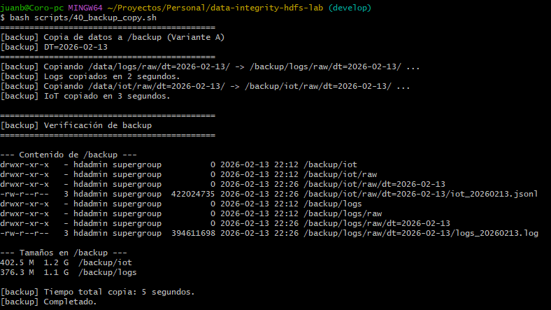

### Inventario origen vs destino (50_inventory_compare.sh)
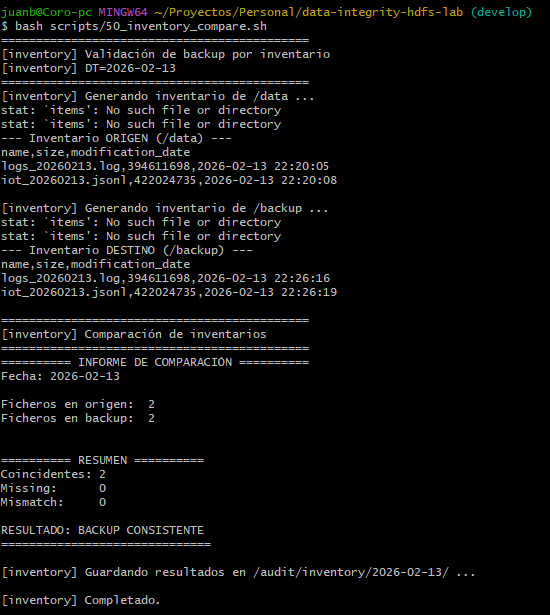

### Resultado de comparación
- Ficheros en origen: **2**
- Ficheros en backup: **2**
- Coincidentes: **2**
- Missing: **0**
- Mismatch: **0**
- **Resultado**: **BACKUP CONSISTENTE**

---

## 6) Métricas de replicación (60_replication_metrics.sh)

### Experimento de replicación
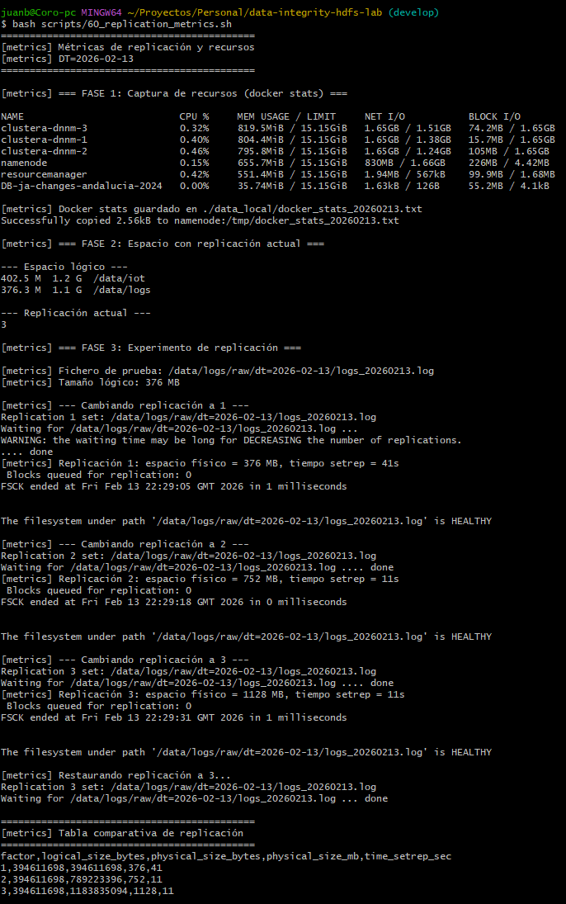

| Factor | Espacio lógico | Espacio físico | Tiempo setrep (s) | Observaciones |
|--------|----------------|----------------|-------------------|---------------|
| 1 | 376 MB | 376 MB | 41 | Sin tolerancia a fallos |
| 2 | 376 MB | 752 MB | 11 | Tolera 1 fallo |
| 3 | 376 MB | 1128 MB | 11 | Tolera 1 fallo + re-replicación segura |

### Docker stats
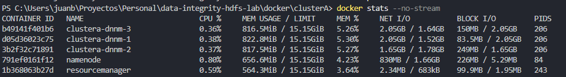

```
CONTAINER ID   NAME                CPU %   MEM USAGE / LIMIT     NET I/O           BLOCK I/O
clustera-dnnm-3    0.36%   816.5MiB / 15.15GiB   2.05GB / 1.64GB   150MB / 2.05GB
clustera-dnnm-1    0.38%   822.8MiB / 15.15GiB   2.05GB / 1.52GB   83.5MB / 2.05GB
clustera-dnnm-2    0.37%   817.5MiB / 15.15GiB   1.65GB / 1.78GB   1.65GB / 1.65GB
namenode           0.80%   656.6MiB / 15.15GiB   830MB / 1.66GB    226MB / 5.29MB
resourcemanager    0.59%   564.3MiB / 15.15GiB   2.34MB / 683kB    99.9MB / 1.95MB
```

---

## 7) Incidente + recuperación

> **Nota**: Las capturas del incidente (70_incident_simulation.sh) y recuperación (80_recovery_restore.sh)
> no están disponibles. El script de incidente espera 15 minutos para que HDFS detecte la caída del DataNode.

### Incidente simulado
- **Tipo**: Caída de DataNode
- **DataNode detenido**: `clustera-dnnm-3`
- **Tiempo de espera**: 15 minutos (para detección de HDFS)

### Comportamiento esperado
- ANTES: 3 DataNodes, Status HEALTHY, 0 Under-replicated
- DESPUÉS (15 min): 2 DataNodes activos, bloques Under-replicated
- RECUPERACIÓN: Re-arranque del DataNode → re-replicación automática → HEALTHY

---

## 8) Conclusión y recomendación

**Factor de replicación recomendado: 3**
- Con 3 DataNodes y replicación 3, cada bloque tiene copia en todos los nodos
- Coste: 3x espacio en disco (1128 MB físicos por 376 MB lógicos)
- Beneficio: Tolerancia a la caída de 1 nodo sin pérdida de datos

**Frecuencia de auditoría recomendada: Diaria**
- `hdfs fsck` es una operación de solo lectura (no impacta rendimiento)
- Permite detectar bloques UNDER_REPLICATED o CORRUPT antes de que se acumulen
- En producción: semanal + alertas automáticas del NameNode

**Validación de backup:**
- El backup a `/backup` fue exitoso y consistente
- Inventario verificado: 2 ficheros, 0 errores
